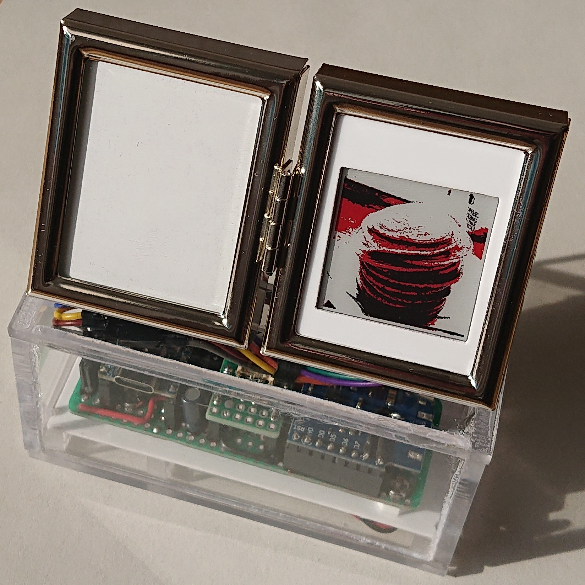
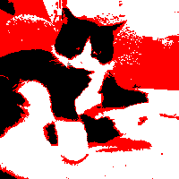

# ePaper-Picture

## Description
A photo frame based on a 1.54 inch ePaper display with colors black red and white. The project includes code for an ESP32-S2 type microcontroler and a lightwight modification of the Waveshare ESP32 ePaper driver board libraryy to run on the ESP32-S2. In addition, the project contains some documentation on the hardware setup of the photo frame.

## Visuals

     

## Installation
Arduino IDE 2.3.2 by Arduino with libraries
- Modification of Waveshare ePaper display library for ESP32 driver
- ESP32 Arduino IDE board (https://github.com/espressif/arduino-esp32/tree/master/libraries/SD/src)

## Usage
Please, refer to the documentation [Link >>](doc/Documentation.md).

## Support
Documentation in this Git project and in the source code is the only available support.

## Contributing
You are welcome to make suggestions for improvements and additions. Please, also feel free to work with your own copy 
and modification of the original source code.

## License
Copyright (c) 2024 Daniel Hutzschenreuter (ORCID: 0000-0002-9095-0063)

Permission is hereby granted, free of charge, to any person obtaining a copy 
of this software and associated documentation files (the “Software”), to deal 
in the Software without restriction, including without limitation the rights to 
use, copy, modify, merge, publish, distribute, sublicense, and/or sell copies of 
the Software, and to permit persons to whom the Software is furnished to do so, 
subject to the following conditions:

The above copyright notice and this permission notice shall be included in all copies 
or substantial portions of the Software.

THE SOFTWARE IS PROVIDED “AS IS”, WITHOUT WARRANTY OF ANY KIND, EXPRESS OR IMPLIED, 
INCLUDING BUT NOT LIMITED TO THE WARRANTIES OF MERCHANTABILITY, FITNESS FOR A 
PARTICULAR PURPOSE AND NONINFRINGEMENT. IN NO EVENT SHALL THE AUTHORS OR COPYRIGHT 
HOLDERS BE LIABLE FOR ANY CLAIM, DAMAGES OR OTHER LIABILITY, WHETHER IN AN ACTION 
OF CONTRACT, TORT OR OTHERWISE, ARISING FROM, OUT OF OR IN CONNECTION WITH THE 
SOFTWARE OR THE USE OR OTHER DEALINGS IN THE SOFTWARE. 

## Project status
Non-regular updates.
