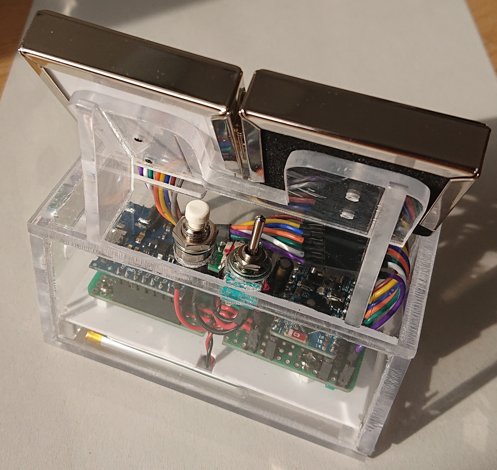
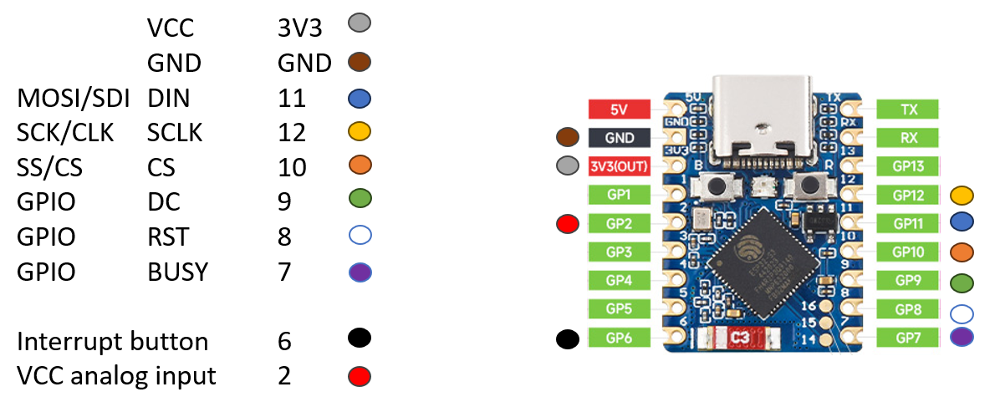
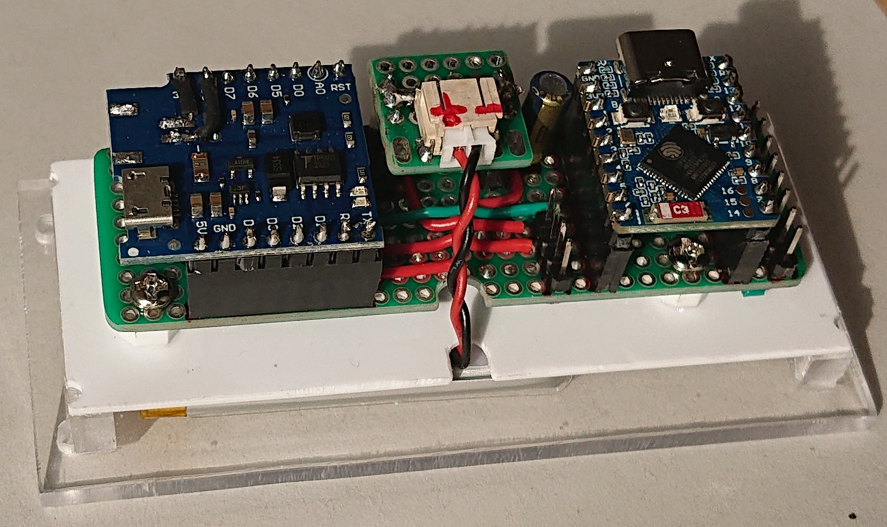
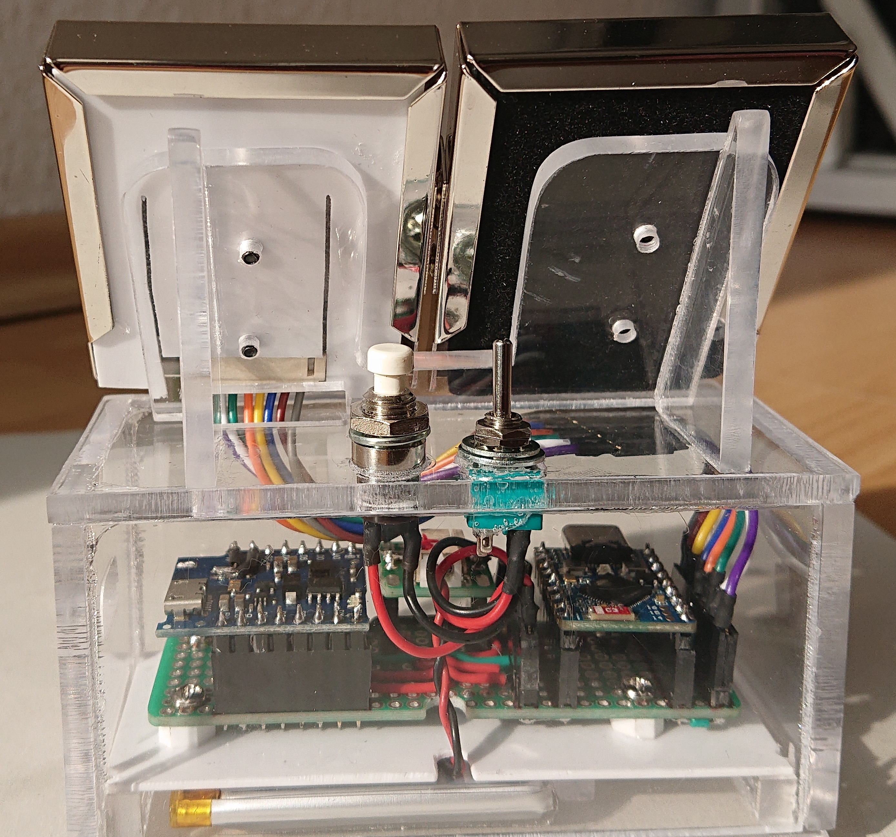

## Basic Operation Instruction

A set of different pictures is stored on the ESP32 microcontroller. They are displayed on the ePaper one after another in a loop. Each image is displayed for 200 seconds (the time can be changes in teh code). The electronics are powered by a LiPo battery. When the charge of the battery becomes low, the display shows a warning. Before the battery is empty, the operation is stopped and the display is cleared.

          

**Power on**

There is a power on/off switch on the back of the device. When the switch is turned on, the photo frame starts the loop through the images. When charging the device, it is recommended to turn the power switch off.

          

**Clear display**

The button on the back of the device triggers an interrupt event that clears the display and stops the operation of the photo frame. This function is to clear the display before turning the power off. It is a recommendation of the manufacturer of the ePaper display to clear the display when turning it off for a longer time (more then 24 hours).

**Charge device**
On the side of the photo frame is a micro USB charging port. When charging, a red LED is on. When the battery is fully charged, a green LED is on. When charging, it is recommended to turn the device off with the power switch.

## Hardware

The photo frame has been build with the following IoT components:
- Waveshare 1.54 inch ePaper display B version 2 with colors black, red, white
- Waveshare ESP32-S2-Zero microcontroler
- D1 mini power supply module (3.7 volt LiPo batterycharger and 5 V step-up converter)
- 3.7 V LiPo battery 

**Pinout of the Pico WH and connection of components**



**Figure of the electronics setup**



**Figure of the controls**




## software

The software was developped and uploaded with the Arduino IDE 2.3.2 by Arduino using the following libraries:

- Modification of Waveshare ePaper display library for ESP32 driver
- ESP32 Arduino IDE board (https://github.com/espressif/arduino-esp32/tree/master/libraries/SD/src)
- ESP32-S2 Dev Module (selected board)

The main code file is ePaper-Picture.ino. The loop function implements a finite automate with different behaviour based on the charging status of the battery (ACTIVE = battery full, CHARGE = request to chare device, STOPED = operation stoped). 

When active, the loop through the images is running. Images are displayed using the Waveshare EPD library. It communicates with the display through the SPI interface. After each picture update, the display is set to sleep mode to prevent damage of the display (recommendation by Waveshare).


In file EPD.ino methods for printing pictures on the display are implemented. The images are stored as C-Array data in the ImageData.c file.

The InterruptHandler.ino contains the method handling the interrupt. The interrupt is listening to a pull-down event on GPIO 6.

The file VoltageHandler.ino contains the method reading the voltage of the battery. It is running analogRead on GPIO 2. Three readings are made and the arithmetic mean is used as the voltage reference value. The ADC runs with a reference of 3.3 V. As the battery provides between 3.3 V and 4.2 V, the voltage of the battery must fist be reduced before reading it at GPIO 2. Here, a voltage devider with two 1 MOhm (mega ohm) resistors is used.

```
+VCC (battery) o---------[1 MOhm]----+---------o GPIO2
                                     |
           GND o---------[1 MOhm]----+
```
           
The serial port is running on 115200 baude. When the DEBUG_MODE is set true, information on the chargig status and operation status is outputted to the serial port.
